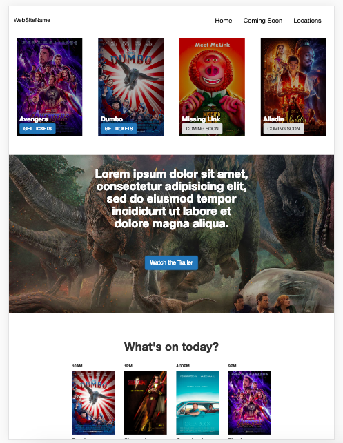
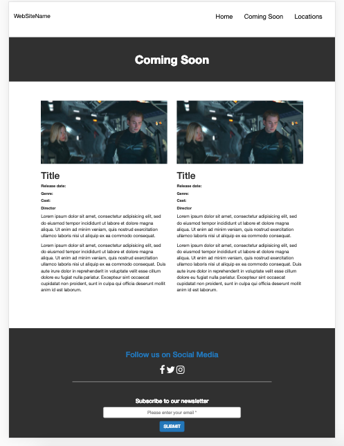
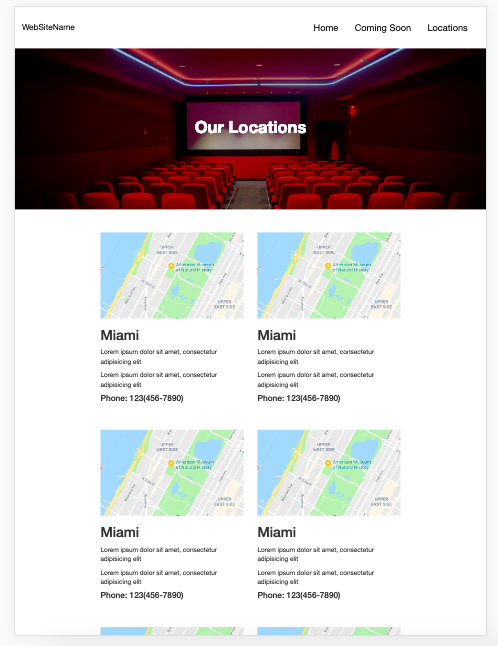
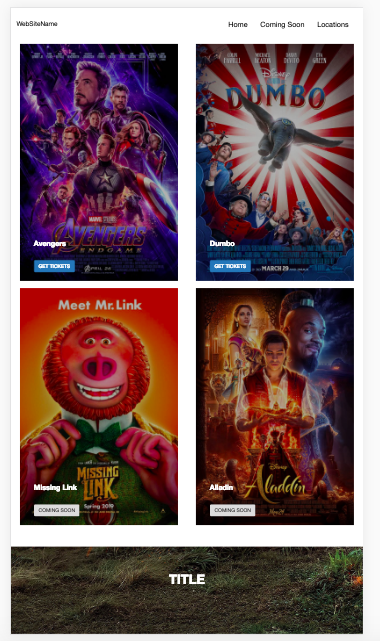

# sparta-site-project

**Task:** To product a responsive three page website using the Bootstrap framework. 

**Result:** Created a website for a cinema with the following pages: 
- Home page
- Coming Soon page
- Our Location page

Used bootstrap rows and collumns to seperate elements on each page, so that the website wasresponsive. Also made the website responsive for different device screens, implemented different layouts for iPad Pro and iPhones. Included styling using CSS to create a simple easy to read website.  

#### Home Page

#### Coming Soon Page

#### Our Locations Page

#### Home Page at mobile width

